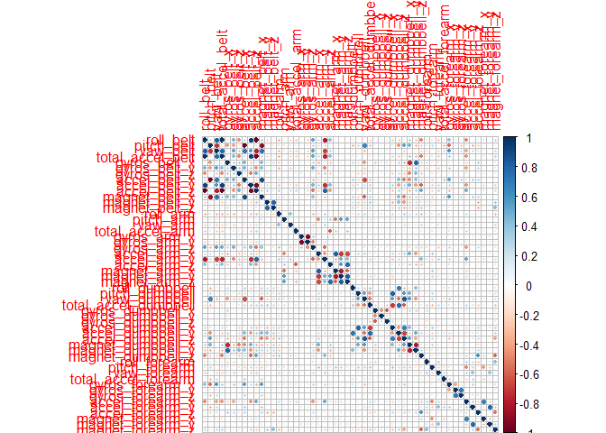
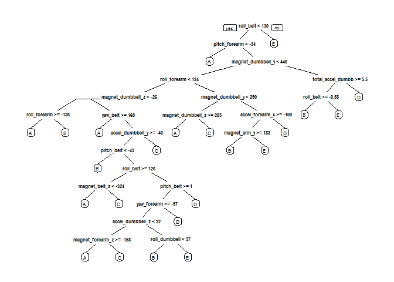

# Coursera Practical Machine Learning Final Project
Kalyan Saikia  
August 13, 2016  


## INTRODUCTION 

Background of the project:
Using devices such as Jawbone Up, Nike FuelBand, and Fitbit it is now possible to collect a large amount of data about personal activity relatively inexpensively. These type of devices are part of the quantified self movement – a group of enthusiasts who take measurements about themselves regularly to improve their health, to find patterns in their behavior, or because they are tech geeks. One thing that people regularly do is quantify how much of a particular activity they do, but they rarely quantify how well they do it. 

In this project, the goal is to use data from accelerometers on the belt, forearm, arm, and dumbell of 6 participants and predict the manner in which they did the exercise. They were asked to perform barbell lifts correctly and incorrectly in 5 different ways. 

### Loading required R packages for the current study


```r
library(caret)
```

```
## Loading required package: lattice
```

```
## Loading required package: ggplot2
```

```r
library(rpart)
library(rpart.plot)
```

```
## Warning: package 'rpart.plot' was built under R version 3.2.5
```

```r
library(RColorBrewer)
library(rattle)
```

```
## Warning: package 'rattle' was built under R version 3.2.5
```

```
## Rattle: A free graphical interface for data mining with R.
## Version 4.1.0 Copyright (c) 2006-2015 Togaware Pty Ltd.
## Type 'rattle()' to shake, rattle, and roll your data.
```

```r
library(randomForest)
```

```
## randomForest 4.6-12
```

```
## Type rfNews() to see new features/changes/bug fixes.
```

```
## 
## Attaching package: 'randomForest'
```

```
## The following object is masked from 'package:ggplot2':
## 
##     margin
```

```r
library(corrplot)
```

```
## Warning: package 'corrplot' was built under R version 3.2.5
```

## Data Collection

The training data for this project are available here:

https://d396qusza40orc.cloudfront.net/predmachlearn/pml-training.csv

The test data are available here:

https://d396qusza40orc.cloudfront.net/predmachlearn/pml-testing.csv

These two datasets are downloaded and copied into local disk and then loaded into R using 'read.csv' function.


```r
set.seed(30001)
# Reading the original data
train_Raw <- read.csv('./pml-training.csv', header=T, na.strings = c("", "NA"))
validationRaw <- read.csv('./pml-testing.csv', header=T, na.strings = c("", "NA"))

dim(train_Raw)
```

```
## [1] 19622   160
```

```r
dim(validationRaw)
```

```
## [1]  20 160
```

### Data Cleanup
Data cleanup is a very important step in this analysis. 
Here we will get rid of the observations with missing values and some meaningless variables. 

First we remove columns that contain NA/missing values.
Since data doesn't have time dependence so the columns with time information are removed from tha dataset including the first column (i.e. observation number). However, in the cleaned dataset, the variable 'classe' is kept as it will be use to develop the model.

```r
sum(complete.cases(train_Raw))
```

```
## [1] 406
```

```r
# removing the columns with NA values
train_Raw <- train_Raw[, colSums(is.na(train_Raw)) == 0] 
validationRaw <- validationRaw[, colSums(is.na(validationRaw)) == 0] 

# Removing unwanted columns
train_Raw <- train_Raw[,c(8:60)] 
validationRaw<- validationRaw[, c(8:60)] 
```

### Data partitioning

In this project the test dataset downloaded from the data source will be used as validation data. 
To carry out current prediction model the original training dataset (pml-training.csv) is partitioned into two datasets i.e. test and train.

```r
#partitioning original train data into two parts
train_sample <- createDataPartition(y=train_Raw$classe, p=0.7, list=FALSE)
train_data <- train_Raw[train_sample, ]
test_data <- train_Raw[-train_sample, ]
```

##Data Modeling
In this analysis we tried to fit Random forest algorithm to fit predictive model for recognition of activity. The reasons for selecting Random Forest are: (1) It automatically identifies the important variables and (2) It produces robust correlated covariates and outliers. 
While employing Random Forest algorithm we applied 5 fold cross validation of the algorithm.


```r
Rfcontrol <- trainControl(method="cv", 5) # Specifying Random Forest method

Rfmodel <- train(classe ~ ., data=train_data, method="rf", trControl=Rfcontrol, ntree=250)
Rfmodel #Display the model parameters
```

```
## Random Forest 
## 
## 13737 samples
##    52 predictor
##     5 classes: 'A', 'B', 'C', 'D', 'E' 
## 
## No pre-processing
## Resampling: Cross-Validated (5 fold) 
## Summary of sample sizes: 10990, 10990, 10989, 10989, 10990 
## Resampling results across tuning parameters:
## 
##   mtry  Accuracy   Kappa      Accuracy SD  Kappa SD   
##    2    0.9906095  0.9881206  0.002512753  0.003178846
##   27    0.9905365  0.9880289  0.001287251  0.001629189
##   52    0.9845672  0.9804761  0.001757133  0.002225352
## 
## Accuracy was used to select the optimal model using  the largest value.
## The final value used for the model was mtry = 2.
```

After building model, the performance was tested using the partitioned test data as below:


```r
Rfpredict <- predict(Rfmodel, test_data)
confusionMatrix(test_data$classe, Rfpredict)
```

```
## Confusion Matrix and Statistics
## 
##           Reference
## Prediction    A    B    C    D    E
##          A 1671    2    0    0    1
##          B   14 1124    1    0    0
##          C    0    6 1019    1    0
##          D    0    0   18  944    2
##          E    0    0    0    0 1082
## 
## Overall Statistics
##                                           
##                Accuracy : 0.9924          
##                  95% CI : (0.9898, 0.9944)
##     No Information Rate : 0.2863          
##     P-Value [Acc > NIR] : < 2.2e-16       
##                                           
##                   Kappa : 0.9903          
##  Mcnemar's Test P-Value : NA              
## 
## Statistics by Class:
## 
##                      Class: A Class: B Class: C Class: D Class: E
## Sensitivity            0.9917   0.9929   0.9817   0.9989   0.9972
## Specificity            0.9993   0.9968   0.9986   0.9960   1.0000
## Pos Pred Value         0.9982   0.9868   0.9932   0.9793   1.0000
## Neg Pred Value         0.9967   0.9983   0.9961   0.9998   0.9994
## Prevalence             0.2863   0.1924   0.1764   0.1606   0.1844
## Detection Rate         0.2839   0.1910   0.1732   0.1604   0.1839
## Detection Prevalence   0.2845   0.1935   0.1743   0.1638   0.1839
## Balanced Accuracy      0.9955   0.9949   0.9901   0.9974   0.9986
```

Determining model accuracy and Out-of-sample Error 


```r
accuracy <- postResample(Rfpredict, test_data$classe) # Model Accuracy
accuracy
```

```
##  Accuracy     Kappa 
## 0.9923534 0.9903254
```

```r
oose <- 1 - as.numeric(confusionMatrix(test_data$classe, Rfpredict)$overall[1]) # Out-of-sample error estimation
oose
```

```
## [1] 0.007646559
```

From the above parameter, the accuracy of modeling is estimated as 99.42% and out-of-sample error is 0.58%

## Final Model Prediction
After analysing the accuracy and out-of-sample error it was decided to go ahead Random Forest algorithm to predict the parameters 'classe' in the validation dataset. Here we are going to predict the the manner in which excercise was carried using the validation dataset for 20 observations. In this step we apply the model to the original test dataset as downloaded from the source.

After reviewing data it was noticed a column called "problem_id" exist which needs to be removed before prediction.

```r
validationRaw<-validationRaw[,c(1:53)] #Removing 'problem_id'

Finalresult <- predict(Rfmodel, validationRaw)
Finalresult
```

```
##  [1] B A B A A E D B A A B C B A E E A B B B
## Levels: A B C D E
```

## Appendix
Viewing the correlation matrix and decision tree


```r
CP <- cor(train_data[, -length(names(train_data))])
corrplot(CP, method="circle")
```




Vizualizing the Decision Tree


```r
treeModel <- rpart(classe ~ ., data=train_data)
prp(treeModel) # fast plot
```



